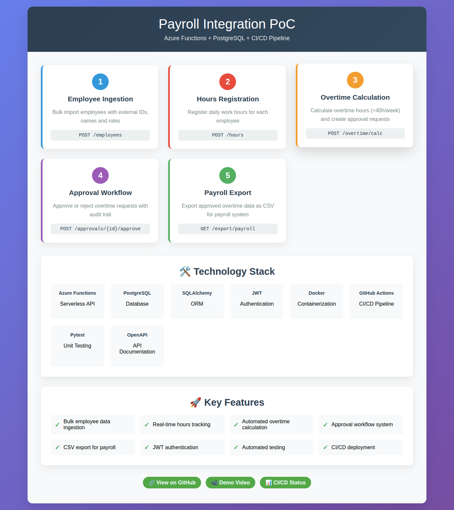

Payroll Integration PoC: Azure Functions + API Management
PoC that exposes endpoints for: time recording, overtime calculations with approval flow, and file exports for the payroll system. Includes a CI/CD pipeline with GitHub Actions that runs tests and deploys a staging. 

